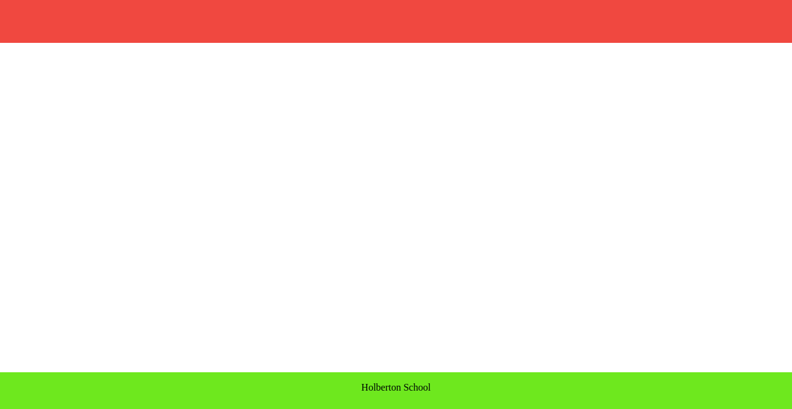
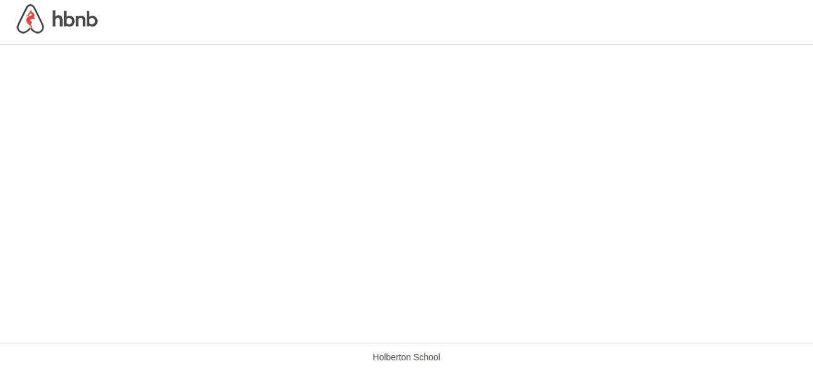
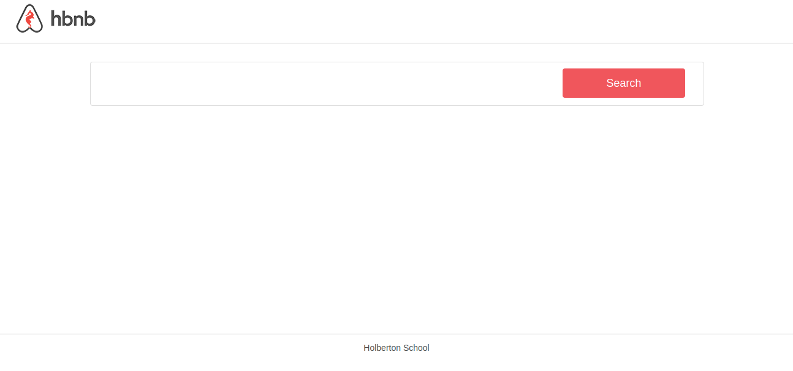
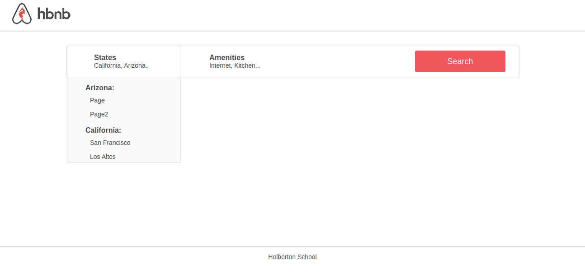
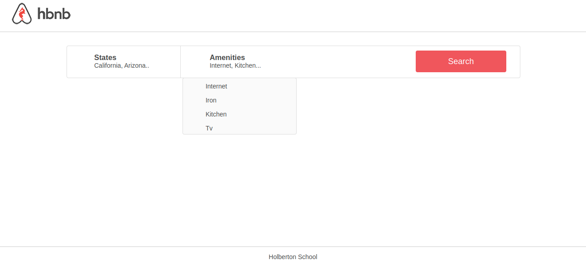
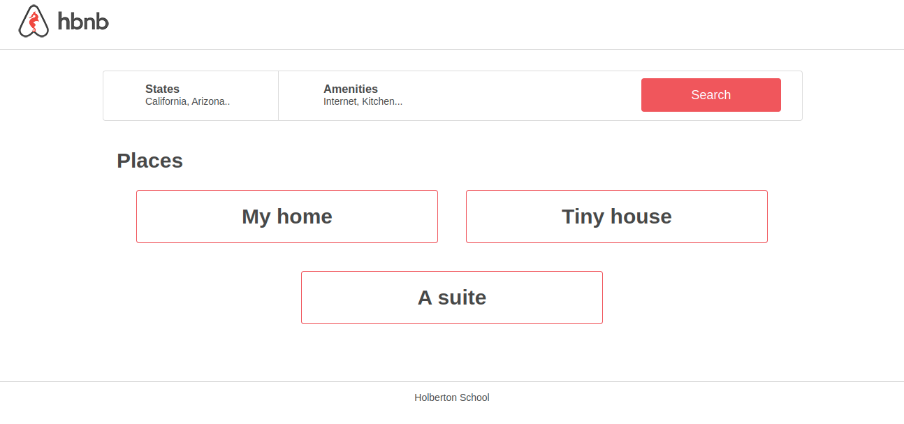
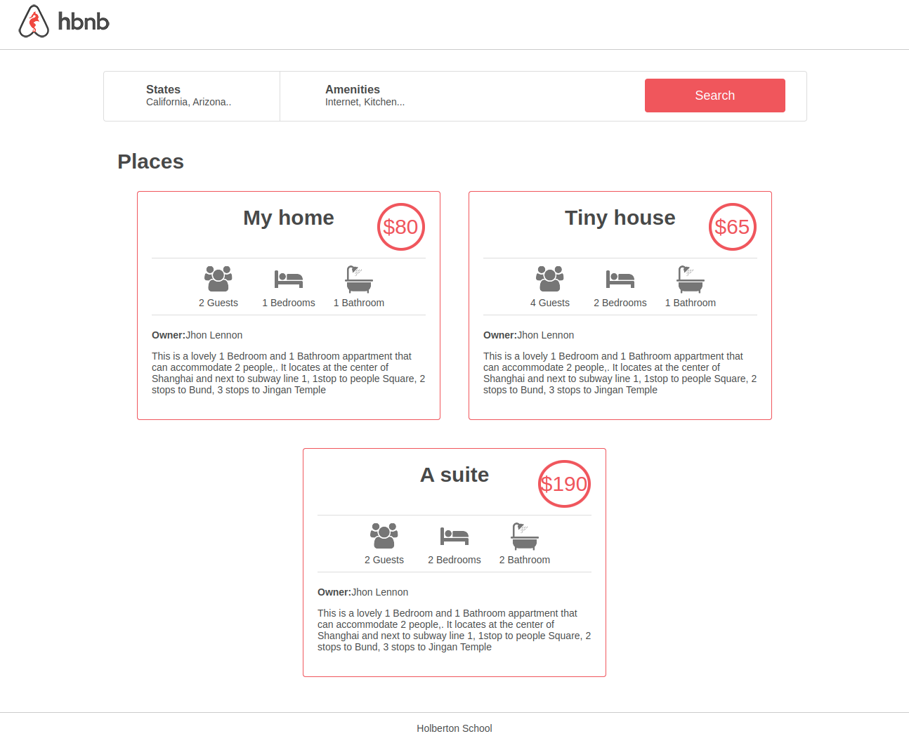

# AirBnB clone - Web static
## 🧩 Web static, what?

Now that we have a command interpreter for managing our AirBnB objects, it’s time to make them alive!

Before developing a big and complex web application, we will build the front end step-by-step.

The first step is to “design” / “sketch” / “prototype” each element:

* Create simple HTML static pages
* Style guide
* Fake contents
* No Javascript
* No data loaded from anything

During this project, we are learning how to manipulate HTML and CSS languages. HTML is the structure of our page, it should be the first thing to write. CSS is the styling of pages, the design. 

## 🎨Some screenshot spet by step
[task0](https://github.com/HanaOuerghemmi/holbertonschool-AirBnB_clone/blob/main/web_static/0-index.html)

[task3](https://github.com/HanaOuerghemmi/holbertonschool-AirBnB_clone/blob/main/web_static/3-index.html)

[task4](https://github.com/HanaOuerghemmi/holbertonschool-AirBnB_clone/blob/main/web_static/4-index.html)

[task5](https://github.com/HanaOuerghemmi/holbertonschool-AirBnB_clone/blob/main/web_static/5-index.html)

[task7](https://github.com/HanaOuerghemmi/holbertonschool-AirBnB_clone/blob/main/web_static/7-index.html)

[task8](https://github.com/HanaOuerghemmi/holbertonschool-AirBnB_clone/blob/main/web_static/8-index.html)

